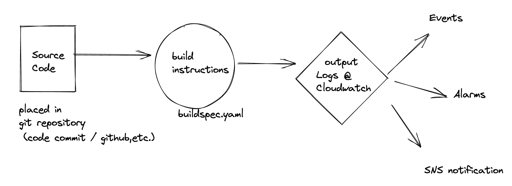

- Overview
	- It is elastic and server less service
	- It's AWS equivalent of build tools like Jenkins
	- Uses Docker under the hood (We can also use custom docker images) #exam-revise
	- It's secured : #exam-revise
	  collapsed:: true
		- can be controlled with [[IAM]]
		- Network settings can be played with [[VPC]]
		- [[KMS]] to encrypt build artifcats
		- [[CloudTrail]] to track API calls
- Working flow
	- 
- #exam-revise 
  #+BEGIN_NOTE
  Timeout and Queue timings can be set from 5 minutes to 8 hours. Where as in Lambda we get only max of 15 min runtime
  #+END_NOTE
- buildspec.yaml file Deep dive
	- sample
	  collapsed:: true
		- ```
		  version: 0.2
		  
		  phases:
		    install:
		      runtime-versions:
		        java: corretto11
		    pre_build:
		      commands:
		        - echo Nothing to do in the pre_build phase...
		    build:
		      commands:
		        - echo Build started on `date`
		        - mvn install
		      finally:
		        - echo Whoohoo
		    post_build:
		      commands:
		        - echo Build completed on `date`
		  artifacts:
		    files:
		      - target/messageUtil-1.0.jar
		  ```
	- 4 phases which can define #exam-revise
	  collapsed:: true
		- 1. install
		  2. pre-build
		  3. build
		  4. post-build
	- commands vs finally
	  collapsed:: true
		- Finally is executed post commands and it will be executed for sure even if command initialised any error on execution
		- #+BEGIN_TIP
		  Finally is used to do any cleanup before terminating
		  #+END_TIP
	- Reference for buildspec syntax [here](https://docs.aws.amazon.com/codebuild/latest/userguide/build-spec-ref.html#build-spec-ref-syntax)
	- Use case based samples can be found [here](https://docs.aws.amazon.com/codebuild/latest/userguide/use-case-based-samples.html) #hands-on
- #+BEGIN_TIP
  How to decide which command to go in which phase??
  
  Remember if it's pre requisite and mandatory for a job like credentials, cloing repo etc all must go in pre-build phase
  #+END_TIP
- #+BEGIN_TIP
  Use `printenv` command to list all the local env variables
  #+END_TIP
- Environment variables in buildspec file
  collapsed:: true
	- This is to pass any value and to access the variable at runtime
	- Types:
	- Plaintext
		- If it's non-sensitive information, just store it as plain text
	- Parameter store
		- For Sensitive information like password never save it as plaintext, always store in [[parameter store]] and refer that here
- Artifacts
  collapsed:: true
	- Any files that generated as outcome post running build is called artificats
	- In artificat section of buildspec file we declare what files are to be included under artifcat
	- The artifacts can be uploaded to S3 . Refer [How to here](https://docs.aws.amazon.com/codebuild/latest/userguide/sample-disable-artifact-encryption.html) #hands-on
- [[CloudWatch]] integration
	- For each build individual CloudWatch log stream will be created
	- We get below metrics from CloudWatch #exam-revise
		- Succeed builds
		- Failure builds
		- Total builds
		- Duration Average
- #+BEGIN_QUOTE
  Have a read on User guide from AWS [here](https://docs.aws.amazon.com/codebuild/latest/userguide/welcome.html) 
  #+END_QUOTE